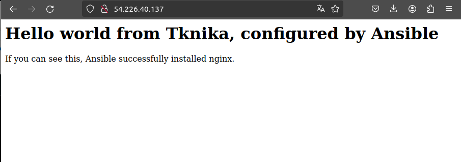

# 3. eguneko ariketa: Ansible erabiliz nginx web zerbitzari bat abiarazi

> [!IMPORTANT]
> Lan-eremua prestatzeko, pauso hauek jarraitzea gomendatzen da: 1) .pem fitxategia proiektuko karpetara kopiatu, 2) hosts fitxategian makina birtualaren IP helbidea idatzi, 3) terminalean, ```. setup.sh``` komandoa exekutatu

Ariketa honetan, Ansible erabiliz web estatiko bat zerbitzatzea eskatzen da.

> [!WARNING]  
> Web orrialdea 80 portuan zerbitzatzen denez, AWS Academy-ko makina birtualeko segurtasun erregeletan 80 portua ireki beharko litzateke.

Playbook-ean idatzi beharreko pausoak:

- nginx instalatu (apt modulua erabiliz)
- 'files' karpetaren barruan dagoen 'nginx.conf' fitxategia karpeta egokira kopiatu (/etc/nginx/sites-available/default)
- 'files' karpetaren barruan dagoen 'index.html' fitxategia karpeta egokira kopiatu (/usr/share/nginx/html/index.html)
- nginx-eko 'sites-available' fitxategia 'aktibatu' ('sites-enabled'-en link bat sortu)
- nginx berrabiarazi

Azkenik, "http://\<makina-birtualaren-helbidea\>" URL-a nabigatzaile batean ireki eta nginx-en web interfazea ikusi beharko litzateke:



Animo!